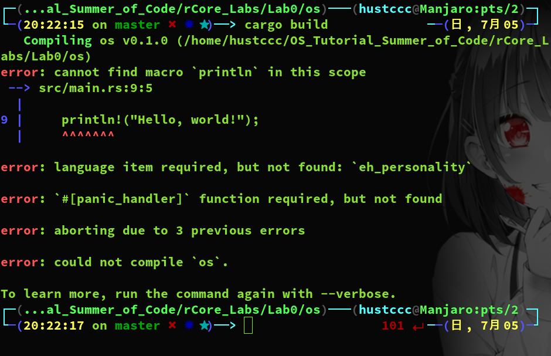
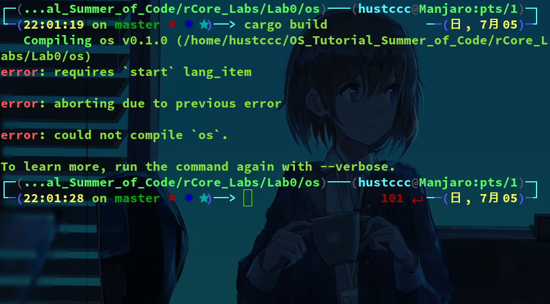
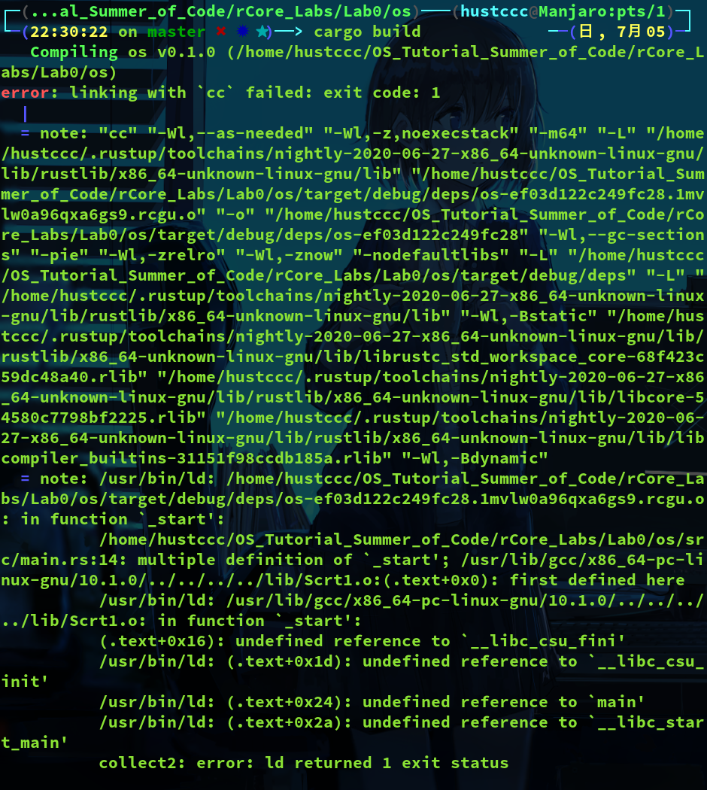
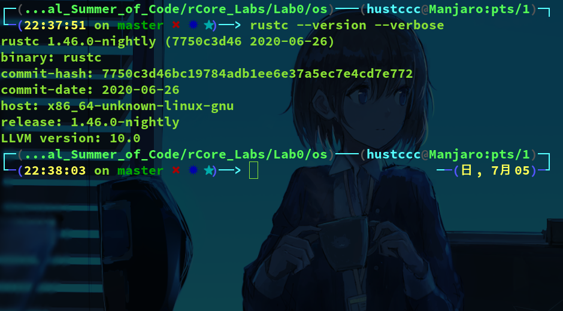
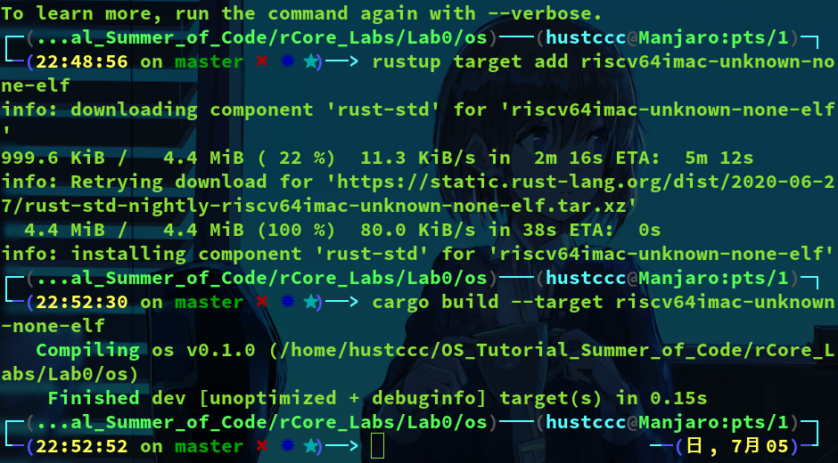
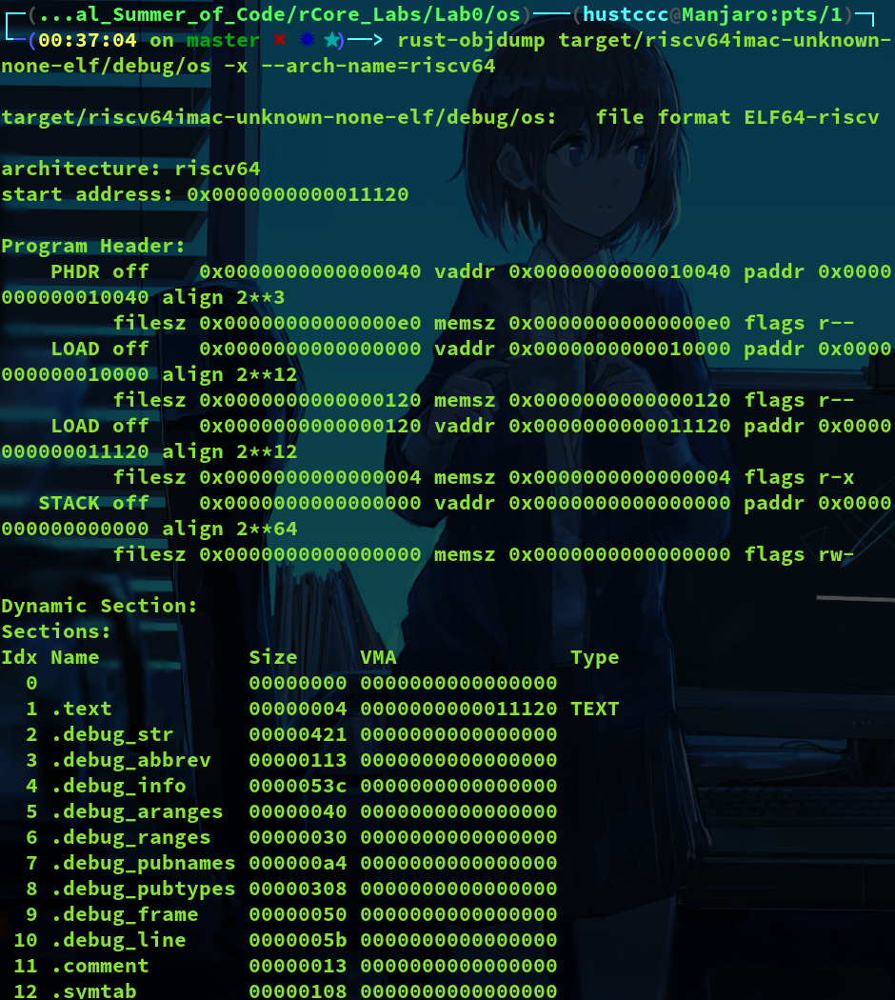
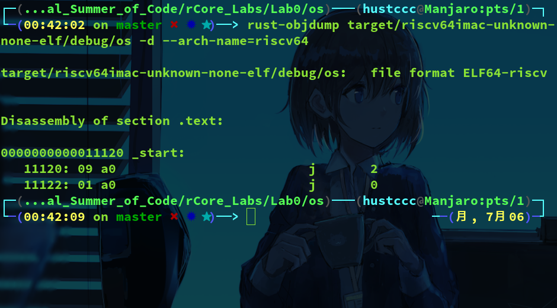
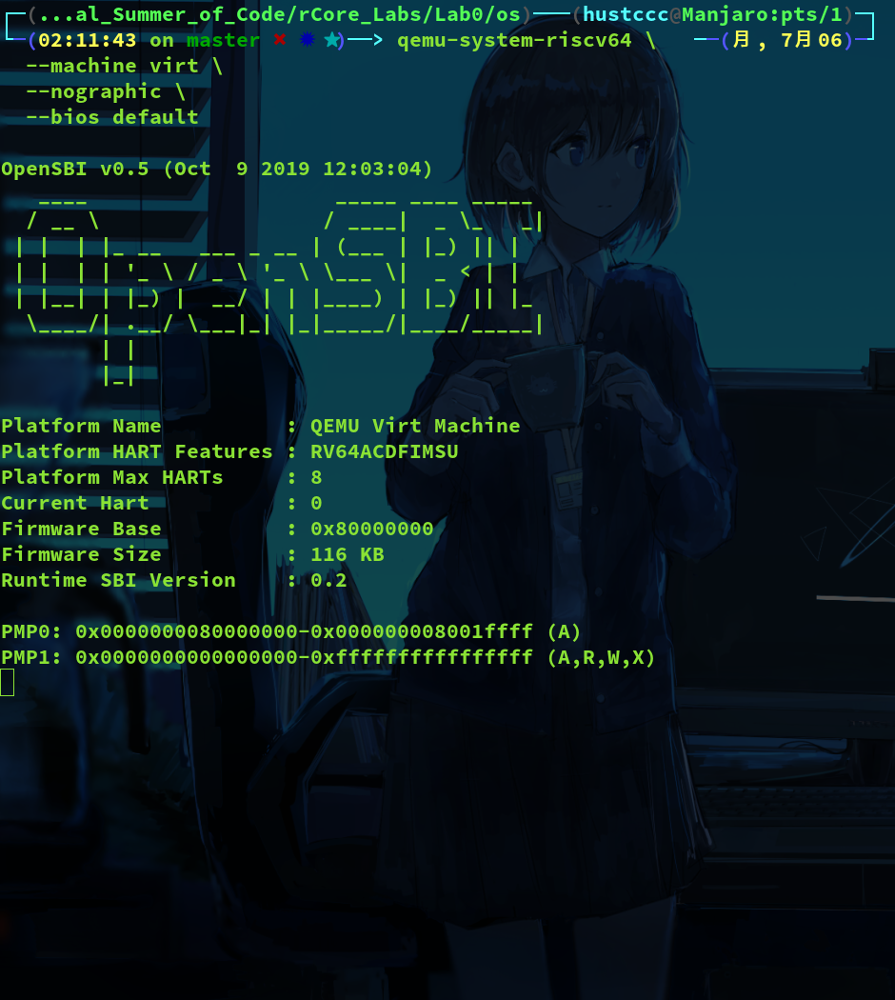
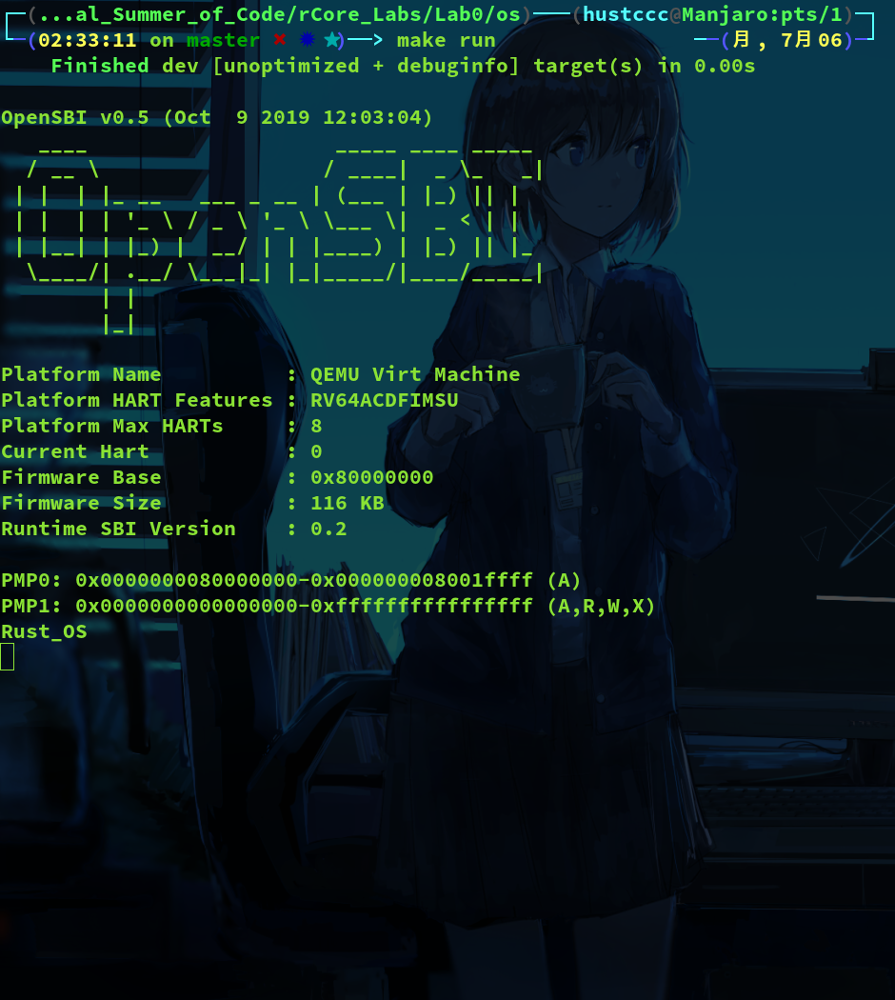
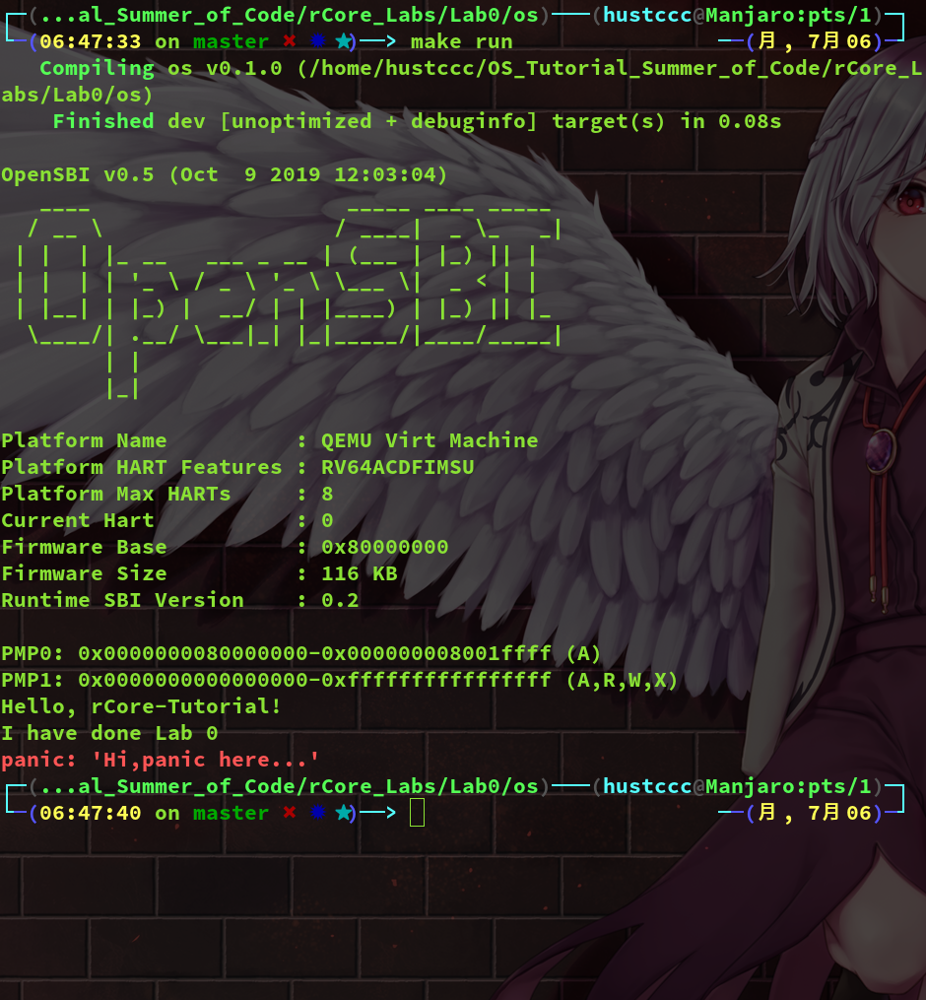

# Lab0 Report

## 实验目的
熟悉用Rust开发OS的一些方法，平台，和qemu模拟器开发环境，为后续实验作准备

## 实验内容
+ 用Rust包管理器cargo创建一个Rust项目
+ 移除Rust程序对操作系统的依赖构建一个独立化可执行的程序
+ 我们将程序的目标平台设置为RISC-V，这样我们的代码将可以在RISC-V指令集的裸机上执行Rust代码
+ 生成内核镜像，调整代码的内存布局并在qemu模拟器中启动
+ 封装如输出，关机等一些SBI的接口，方便后续开发

## 实验步骤
1. 创建项目
2. 移除标准库依赖
3. 移除运行时环境依赖
4. 编译为裸机目标
5. 生成内核镜像
6. 调整内存布局
7. 重写程序入口点
8. 使用qemu运行
9. 接口封装和代码整理

## 实验过程
### 创建项目
在$HOME/OS_Summer_of_Code/rCore_Labs/创建Lab0工作目录，在该工作目录下创建rust-toolchain文件，写入工具链版本：  
```
nightly-2020-06-27
```
然后在此目录下创建Rust项目os  
```
cargo new os
```
（cargo会下载一些东西，需要30分钟左右）  
尝试运行项目  
```
cargo run
...
Hello, world!
```

### 移除标准库依赖
通过显示添加`#![no_std]`禁用标准库  
```
/*
 * rCore Labs: Lab 0
 * 2020/7/5
 * hustccc
 * Manjaro
 */
#![no_std]
fn main() {
    println!("Hello, world!");
}
```
cargo build构建项目，出现以下错误：  
  
第一个错误指出println!宏没找到，因为这个宏属于Rust标准库std，于是将这个println!语句删除。  
第二个错误指出需要一个函数作为panic_handler，这个函数负责在程序发生panic时调用。它默认使用标准库std中实现的函数并依赖于操作系统特殊的文件描述符。  
下面是自己实现panic!函数：  
```
//os/src/main.rs
use core::panic::PanicInfo;
#[panic_handler]
fn panic(_info: &PanicInfo) -> ! {
    loop {}
}
```
第三个错误提到了语义项，它是编译器内部所需的特殊函数和类型。  
这个错误相关语义项`eh_personality`是一个标记某函数用来实现堆栈展开处理功能的语义项。  
为了简单起见，当程序出现异常时莓，我们不会进一步捕获异常也不清理现场，我们设置为直接退出程序即可。  修改项目配置文件`Cargo.toml`  
```
//os/Cargo.toml
...
# exit when panic occur
[profile.dev]
panic = "abort"

[profile.release]
panic = "abort"
```
尝试编译：  
  

### 移除运行时环境依赖
这里，我们的程序遗失了`start`语言项，它定义一个程序的`入口点`。  
大多数语言都拥有一个`运行时系统`，它通常为`垃圾回收`或者`绿色线程`。  
一个典型的使用标准库的Rust程序，它的运行将从名为`crt0`的运行时库开始。`crt0`能建立一个适合运行C语言程序的环境，这包含了栈的创建和可执行程序参数的传入。这之后，这个运行时库会调用`Rust的运行时入口点`，这个入口点被称为`start语言项`。这之后，运行时将会调用main函数。  
我们的独立式可执行程序并不能访问Rust运行时或`crt0`库，所以我们需要定义自己的入口点。下面我们重写整个`crt0`库和它定义的入口点。  
添加`#![no_main]`属性告诉Rust编译器不使用预订义的入口点：  
```
#![no_std]
#![no_main]

use core::panic::PanicInfo;
...
```
编写一个`_start`函数：  
```
#[no_mangle]
pub extern "C" fn _start() -> ! {
    loop {}
}
```
用`no_mangle`标记这个函数来对它禁用名称重整。  
再次构建`cargo build`：  
  
出现了`链接器错误`
### 编译为裸机目标
`链接器`是一个程序，它将生成的目标文件组合成一个可执行文件，它的默认配置假定程序依赖于C语言的运行时环境，但我们的程序没有。  
我们通过编译为`裸机目标`来解决这个错误。  
Rust使用一个称为`目标三元组`的字符串来描述不同的环境。运行`rustc --version --verbose`查看当前系统的目标三元组：  
  
Rust编译器尝试为当前系统的三元组编译，并假定底层有一个类似于Linux的操作系统提供C语言运行环境，这就是导致链接器错误的原因。为了避免这个错误，我们另选一个底层没有操作系统的运行环境，即为裸机环境。  

```
rustup target add riscv64imac-unknown-none-elf
cargo build --target riscv64imac-unknown-none-elf	//build
```
传递`--target`参数来为裸机目标系统交叉编译。  
运行结果：  
  
为了后续方便编译，在`os`文件夹中创建一个`.cargo`文件夹，并在其中创建一个名为config的文件，修改其中的内容：  

```
[build]
target = "riscv64imac-unknown-none-elf"
```
这样可以直接使用`cargo build`来编译。  
### 生成内核镜像
首先安装binutils命令行工具集。  
```
cargo install cargo-binutils
rustup component add llvm-tools-preview
```

我们在上面编译之后的文件是`os/target/riscv64imac-unknown-none-elf/debug/os`，查看其文件类型：  
```
target/riscv64imac-unknown-none-elf/debug/os: ELF 64-bit LSB executable, UCB RISC-V, version 1 (SYSV), statically linked, with debug_info, not stripped
```
可以看出是一个64位elf格式的可执行文件，架构为RISC-V，链接方式是静态链接。  

使用rust-objdump工具来查看可执行文件信息：  
  
这里有几个比较关键的属性：  
+ start address：程序入口地址
+ Sections：段信息
+ SYMBOL TABLE：顾名思义，符号表，里面可以看到函数_start处于入口地址中
+ Program Header：程序头，其中的off是偏移量，vaddr和paddr分别是要加载到的虚拟地址和物理地址，align为对齐方式，filesz和memsz分别表示文件大小和在内存中所占空间大小（由于对齐的原因，这两者不一定相等），flags表示文件的权限。

将`-x`参数改为`-d`参数来反汇编可执行文件：  
  
只有一个`_start`函数，函数体里面是个死循环。  

暂时不需要调试信息，因此可以使用rust-objcopy工具从elf格式可执行文件生成内核镜像：  
```
rust-objcopy target/riscv64imac-unknown-none-elf/debug/os --strip-all -O binary target/riscv64imac-unknown-none-elf/debug/kernel.bin
```
这样我们就编译并生成了内核镜像`kernel.bin`文件，在使用qemu模拟器运行内核镜像之前，我们还需要完成一些工作。  

### 调整内存布局
在前面我们可以看到编译出的可执行文件的入口地址为`0x0000000000011120`  
对于普通用户程序，数据是放在低地址空间上的，而对于操作系统内核，它一般是存放在高地址空间，在RISC-V架构中，内存的物理地址也是从`0x8000000`开始的。因此我们需要调整内存布局。  
下面我们编写一个链接脚本：`os/src/linker/linker.ld`，这里涉及到`Linker Script`的知识，可以参考[linker_script](https://sourceware.org/binutils/docs/ld/Scripts.html */)
```
/* 目标架构 */
OUTPUT_ARCH(riscv)

/* 执行入口 */
ENTRY(_start)

/* 数据存放起始地址 */
BASE_ADDRESS = 0x80200000;

SECTIONS
{
    /* . 表示当前地址（location counter） */
    . = BASE_ADDRESS;

    /* start 符号表示全部的开始位置 */
    kernel_start = .;

    text_start = .;

    /* .text 字段 */
    .text : {
        /* 把 entry 函数放在最前面 */
        *(.text.entry)
        /* 要链接的文件的 .text 字段集中放在这里 */
        *(.text .text.*)
    }

    rodata_start = .;

    /* .rodata 字段 */
    .rodata : {
        /* 要链接的文件的 .rodata 字段集中放在这里 */
        *(.rodata .rodata.*)
    }

    data_start = .;

    /* .data 字段 */
    .data : {
        /* 要链接的文件的 .data 字段集中放在这里 */
        *(.data .data.*)
    }

    bss_start = .;

    /* .bss 字段 */
    .bss : {
        /* 要链接的文件的 .bss 字段集中放在这里 */
        *(.sbss .bss .bss.*)
    }

    /* 结束地址 */
    kernel_end = .;
}
```
这里链接工具的作用就是将各个文件的内存布局装配起来生成整个内核的内存布局。  
链接脚本先使用OUTPUT_ARCH指定了架构为RISC-V，随后使用ENTRY指定入口点为`_start`函数。
通过对这个链接脚本的分析，大致可以推出它做了些什么工作：  
+ 指定目标架构，执行入口和数据存放起始地址
+ 以BASE_ADDRESS（0x80200000）为首址放置各个段，依次是.text, .rodata, .data, .stack, .bss
+ 记录每个段的开头和结尾地址

为了在编译时使用上面自定义的链接脚本，在`.cargo/config`文件中加入以下配置：  
```
[build]
target = "riscv64imac-unknown-none-elf"
# use my own linker script
[target.riscv64imac-unknown-none-elf]
rustflags = [
    "-C", "link-arg=-Tsrc/linker/linker.ld",
]
```
重新编译，并查看生成的可执行文件：  
```
-> cargo build
Compiling os v0.1.0 (/home/hustccc/OS_Tutorial_Summer_of_Code/rCore_Labs/Lab0/os)
    Finished dev [unoptimized + debuginfo] target(s) in 0.05s
-> rust-objdump target/riscv64imac-unknown-none-elf/debug/os -h --arch-name=riscv64
target/riscv64imac-unknown-none-elf/debug/os:	file format ELF64-riscv

Sections:
Idx Name            Size     VMA              Type
  0                 00000000 0000000000000000 
  1 .text           00000004 0000000080200000 TEXT
  2 .debug_str      00000421 0000000000000000 
  3 .debug_abbrev   00000113 0000000000000000 
  4 .debug_info     0000053c 0000000000000000 
  5 .debug_aranges  00000040 0000000000000000 
  6 .debug_ranges   00000030 0000000000000000 
  7 .debug_pubnames 000000a4 0000000000000000 
  8 .debug_pubtypes 00000308 0000000000000000 
  9 .debug_frame    00000050 0000000000000000 
 10 .debug_line     0000005b 0000000000000000 
 11 .comment        00000013 0000000000000000 
 12 .symtab         000001b0 0000000000000000 
 13 .shstrtab       000000a5 0000000000000000 
 14 .strtab         0000007f 0000000000000000 
-> rust-objdump target/riscv64imac-unknown-none-elf/debug/os -d --arch-name=riscv64
target/riscv64imac-unknown-none-elf/debug/os:	file format ELF64-riscv


Disassembly of section .text:

0000000080200000 text_start:
80200000: 09 a0                        	j	2
80200002: 01 a0                        	j	0

```
可以看到text_startx地址为0x80200000，程序的入口地址变为了我们在链接脚本中指定的地址  

### 重写程序入口点`_start`
在前面的工作中，实现的入口点`_start`仅仅只是一个死循环，现在我们因为希望这个函数可以设置内核的运行环境而重写它。  
这其实和我之前学习Linux-0.11内核中内核引导启动程序的内容有点相似。  
首先是开电自检，CPU加电之后会进行自检，然后跳转到启动代码，也就是`Bootloader`的入口。在`Bootloader`中，进行各种初始化操作。接着`Bootloader`会将内核代码从硬盘加载到内存中，并跳转到内核入口。  
我们利用现成的`Bootloader`实现`OpenSBI`固件（在`RISC-V`架构中使用的是`OpenSBI`固件，相对于`x86`的`BIOS`或`UEFI`）。  
`OpenSBI`固件运行在`RISC-V-64`的`M Mode`，我们将要实现的操作系统内核运行在`S Mode`，而我们要支持的用户程序运行在`U Mode`。上面三个`Mode`是`RISC-V`架构的三个特权级，这也是`RISC-V`与`x86`与众不同的地方，`x86`只有两个特权级，内核态和用户态。  
这里`OpenSBI`做的一件事情就是把CPU从`M Mode`切换到`S Mode`，接着跳转到一个固定地址0x80200000去执行内核代码。  
创建文件`os/src/asm/entry.asm`：  

```
    .section .text.entry
    .globl _start
# 目前 _start 的功能：将预留的栈空间写入 $sp，然后跳转至 rust_main
_start:
    la sp, boot_stack_top
    call rust_main

    # 回忆：bss 段是 ELF 文件中只记录长度，而全部初始化为 0 的一段内存空间
    # 这里声明字段 .bss.stack 作为操作系统启动时的栈
    .section .bss.stack
    .global boot_stack
boot_stack:
    # 16K 启动栈大小
    .space 4096 * 16
    .global boot_stack_top
boot_stack_top:
    # 栈结尾
```
这是一段很简单的基于`RISC-V`架构的汇编语言，这里简单分析一下：  
+ 因为我们在linker.ld中将程序入口设置为了`_start`因此我们这里需要实现它，目前`_start`的功能仅仅是将分配的一块4096 × 4 Bytes = 16 KBytes内存空间作为启动栈并写入`$sp`（栈顶指针），然后跳转（call指令）到`rust_main`函数。
+ 定义启动栈（`boot_stack`）大小
+ 定义启动栈（`boot_stack_top`）栈顶

下面将`os/src/main.rs`里面的`_start`函数修改为`rust_main`：  
```
//os/src/main.rs
/*
 * rCore Labs: Lab 0
 * 2020/7/5
 * hustccc
 * Manjaro
 */
#![no_std]
#![no_main]
//insert assemble file
#![feature(global_asm)]

//entry
global_asm!(include_str!("asm/entry.asm"));
use core::panic::PanicInfo;

//entry for Rust
#[no_mangle]
pub extern "C" fn rust_main() -> ! {
    loop {}
}

#[panic_handler]
fn panic(_info: &PanicInfo) -> ! {
    loop {}
}
```
下面终于到运行内核环节了  

### 使用qemu运行内核
使用OpenSBI：  
  
下面我们加载内核镜像，为了便于观察我们确实运行起来了我们的内核，在rust_main里面加上简单的输出：  
```
/*
 * rCore Labs: Lab 0
 * 2020/7/5
 * hustccc
 * Manjaro
 */
#![no_std]
#![no_main]
//insert assemble file
#![feature(asm)]
#![feature(llvm_asm)]
#![feature(global_asm)]

//entry
global_asm!(include_str!("asm/entry.asm"));

use core::panic::PanicInfo;

//use inserted assemble for print a char
pub fn console_putchar(ch: u8) {
    let _ret: usize;
    let arg0: usize = ch as usize;
    let arg1: usize = 0;
    let arg2: usize = 0;
    let which: usize = 1;
    unsafe {
        llvm_asm!("ecall"
             : "={x10}" (_ret)
             : "{x10}" (arg0), "{x11}" (arg1), "{x12}" (arg2), "{x17}" (which)
             : "memory"
             : "volatile"
        );
    }
}
//entry for Rust
#[no_mangle]
pub extern "C" fn rust_main() -> ! {
    console_putchar(b'R');
    console_putchar(b'u');
    console_putchar(b's');
    console_putchar(b't');
    console_putchar(b'_');
    console_putchar(b'O');
    console_putchar(b'S');
    console_putchar(b'\n');
    loop {}
}

#[panic_handler]
fn panic(_info: &PanicInfo) -> ! {
    loop {}
}
```
编写`Makefile`来简化编译过程：（对于一个Linux爱好者来说，Makefile简直是神器）  
`os/Makefile`：  
```
TARGET      := riscv64imac-unknown-none-elf
MODE        := debug
KERNEL_FILE := target/$(TARGET)/$(MODE)/os
BIN_FILE    := target/$(TARGET)/$(MODE)/kernel.bin

OBJDUMP     := rust-objdump --arch-name=riscv64
OBJCOPY     := rust-objcopy --binary-architecture=riscv64

.PHONY: doc kernel build clean qemu run env

# 默认 build 为输出二进制文件
build: $(BIN_FILE) 

# 通过 Rust 文件中的注释生成 os 的文档
doc:
    @cargo doc --document-private-items

# 编译 kernel
kernel:
    @cargo build

# 生成 kernel 的二进制文件
$(BIN_FILE): kernel
    @$(OBJCOPY) $(KERNEL_FILE) --strip-all -O binary $@

# 查看反汇编结果
asm:
    @$(OBJDUMP) -d $(KERNEL_FILE) | less

# 清理编译出的文件
clean:
    @cargo clean

# 运行 QEMU
qemu: build
    @qemu-system-riscv64 \
            -machine virt \
            -nographic \
            -bios default \
            -device loader,file=$(BIN_FILE),addr=0x80200000

# 一键运行
run: build qemu
```
作为一个Linux爱好者，当然得对Makefile有所了解，下面简单分析一下：  
+ 前面是对一些编译选项的定义，作用是使Makefile代码简洁易读
+ Makefile的格式这里简单阐述一下，大致上可以分为几个部分：目标项，依赖项，命令。前面的doc,kernel,asm等等就是目标项，目标项后面跟个冒号，冒号后面就是依赖项，往下面一行开始，以tab键开头的就是命令。
+ Makefile先是编译了build，doc，kernel等文件，然后通过参数`-device`来将内核镜像加载到qemu中，并告诉OpenSBI最后跳转到0x80200000这个入口地址。
+ 最后通过`make run`来使用qemu加载内核镜像，并运行我们写的这个简单内核。
运行结果：  
  
可以看到成功打印出了字符'R','u','s','t','_','O','S'。  

### 接口封装和代码管理
OpenSBI实际上不仅起到了Bootloader的作用，还为我们提供了一些服务供我们在编写内核时使用，这层接口叫做`SBI`，是`S Mode`和`M Mode`之间的标准接口。具体可以参考`OpenSBI文档`。  
上面的`console_putchar`函数类似于调用下面的接口来实现：  
```
void sbi_console_putchar(int ch)
```
实际过程是：先通过ecall发起系统调用，OpenSBI检查发起的系统调用的编号，如果在0～8之间，则交由我们自己的中断处理程序处理（暂未实现）。  
执行`ecall`前需要指定系统调用编号，传递参数。一般约定`a7`为系统调用编号，`a0`,`a1`和`a2`为传递的参数：  
`os/src/sbi.rs`  
```
//! 调用 Machine 层的操作
// 目前还不会用到全部的 SBI 调用，暂时允许未使用的变量或函数
#![allow(unused)]

/// SBI 调用
#[inline(always)]
fn sbi_call(which: usize, arg0: usize, arg1: usize, arg2: usize) -> usize {
    let ret;
    unsafe {
        llvm_asm!("ecall"
            : "={x10}" (ret)
            : "{x10}" (arg0), "{x11}" (arg1), "{x12}" (arg2), "{x17}" (which)
            : "memory"      // 如果汇编可能改变内存，则需要加入 memory 选项
            : "volatile");  // 防止编译器做激进的优化（如调换指令顺序等破坏 SBI 调用行为的优化）
    }
    ret
}
```
对于函数调用在汇编层面的知识的掌握，得益于这学期的计算机系统基础课和之前自学的Linux内核知识。  
RISC-V架构下的函数调用规范可以参考`RISC-V Calling Convention`  
这里`sbi_call`函数的实现使用了`内联汇编`，对于内联汇编的知识的掌握得益于这学期的汇编程序设计课，这里简单解释一下：  
+ 输入部分：通过`x10`，`x11`，`x12`和`x17`这四个寄存器传入参数
+ 输出部分：使用`x10`寄存器保存返回值

下面完善SBI接口：  
`os/src/sbi.rs`  
```
const SBI_SET_TIMER: usize = 0;
const SBI_CONSOLE_PUTCHAR: usize = 1;
const SBI_CONSOLE_GETCHAR: usize = 2;
const SBI_CLEAR_IPI: usize = 3;
const SBI_SEND_IPI: usize = 4;
const SBI_REMOTE_FENCE_I: usize = 5;
const SBI_REMOTE_SFENCE_VMA: usize = 6;
const SBI_REMOTE_SFENCE_VMA_ASID: usize = 7;
const SBI_SHUTDOWN: usize = 8;

/// 向控制台输出一个字符
///
/// 需要注意我们不能直接使用 Rust 中的 char 类型
pub fn console_putchar(c: usize) {
    sbi_call(SBI_CONSOLE_PUTCHAR, c, 0, 0);
}

/// 从控制台中读取一个字符
///
/// 没有读取到字符则返回 -1
pub fn console_getchar() -> usize {
    sbi_call(SBI_CONSOLE_GETCHAR, 0, 0, 0)
}

/// 调用 SBI_SHUTDOWN 来关闭操作系统（直接退出 QEMU）
pub fn shutdown() -> ! {
    sbi_call(SBI_SHUTDOWN, 0, 0, 0);
    unreachable!()
}
```
如果只能使用`console_putchar`这种输出方式无疑会给我们后面的调试带来极大的不便，下面我们就来实现`print!`宏和`println!`宏。  

关于格式化输出，Rust中提供了一个接口`core::fmt::Write`，如果实现了函数：  
```
fn write_str(&mut self, s: &str) -> Result
```
就可以调用如下函数：（基于`write_str`函数）  
```
fn write_fmt(mut self: &mut Self, args: Arguments<'_>) -> Result
```
这个函数需要处理`Arguments`类封装的输出字符串，考虑利用现成的`format_args!`宏将模式字符串和参数列表的输入转化为`Arguments`类。  
大致思路：  
+ 解析传入参数，转化为`Arguments`类
+ 调用`write_fmt`函数输出这个类

这部分整个代码放在`os/src/console.rs`下：  
```
//! 实现控制台的字符输入和输出
//! 
//! # 格式化输出
//! 
//! [`core::fmt::Write`] trait 包含
//! - 需要实现的 [`write_str`] 方法
//! - 自带实现，但依赖于 [`write_str`] 的 [`write_fmt`] 方法
//! 
//! 我们声明一个类型，为其实现 [`write_str`] 方法后，就可以使用 [`write_fmt`] 来进行格式化输出
//! 
//! [`write_str`]: core::fmt::Write::write_str
//! [`write_fmt`]: core::fmt::Write::write_fmt

use crate::sbi::*;
use core::fmt::{self, Write};

/// 一个 [Zero-Sized Type]，实现 [`core::fmt::Write`] trait 来进行格式化输出
/// 
/// ZST 只可能有一个值（即为空），因此它本身就是一个单件
struct Stdout;

impl Write for Stdout {
    /// 打印一个字符串
    /// 
    /// 对于每一个字符调用 [`console_putchar`]
    fn write_str(&mut self, s: &str) -> fmt::Result {
        for c in s.chars() {
            console_putchar(c as usize);
        }
        Ok(())
    }
}

/// 打印由 [`core::format_args!`] 格式化后的数据
/// 
/// [`print!`] 和 [`println!`] 宏都将展开成此函数
/// 
/// [`core::format_args!`]: https://doc.rust-lang.org/nightly/core/macro.format_args.html
pub fn print(args: fmt::Arguments) {
    Stdout.write_fmt(args).unwrap();
}

/// 实现类似于标准库中的 `print!` 宏
/// 
/// 使用实现了 [`core::fmt::Write`] trait 的 [`console::Stdout`]
#[macro_export]
macro_rules! print {
    ($fmt: literal $(, $($arg: tt)+)?) => {
        $crate::console::print(format_args!($fmt $(, $($arg)+)?));
    }
}

/// 实现类似于标准库中的 `println!` 宏
/// 
/// 使用实现了 [`core::fmt::Write`] trait 的 [`console::Stdout`]
#[macro_export]
macro_rules! println {
    ($fmt: literal $(, $($arg: tt)+)?) => {
        $crate::console::print(format_args!(concat!($fmt, "\n") $(, $($arg)+)?));
    }
}
```
最后使用实现的格式化输出和关机的函数，将`main`中处理panic的语义项抽取并完善到`panic.rs`中：  
```
//! 代替 std 库，实现 panic 和 abort 的功能

use core::panic::PanicInfo;
use crate::sbi::shutdown;

///
/// ### `#[panic_handler]` 属性
#[panic_handler]
fn panic_handler(info: &PanicInfo) -> ! {
    // `\x1b[??m` 是控制终端字符输出格式的指令，在支持的平台上可以改变文字颜色等等
    // 这里使用错误红
    // 需要全局开启 feature(panic_info_message) 才可以调用 .message() 函数
    // 参考：https://misc.flogisoft.com/bash/tip_colors_and_formatting
    println!("\x1b[1;31mpanic: '{}'\x1b[0m", info.message().unwrap());
    shutdown()
}

/// 终止程序
/// 
/// 调用 [`panic_handler`]
#[no_mangle]
extern "C" fn abort() -> ! {
    panic!("abort()")
}
```
在`os/src/main.rs`中去掉之前写的`console_putchar`并调用整理好的打印函数。  
`os/src/main.rs`
```
/*
 * rCore Labs: Lab 0
 * 2020/7/5
 * hustccc
 * Manjaro
 */
//! # global
#![no_std]
#![no_main]
//#![warn(missing_docs)]
//insert assemble file
#![feature(asm)]
#![feature(llvm_asm)]
#![feature(global_asm)]
#![feature(panic_info_message)]

#[macro_use]
mod console;
mod panic;
mod sbi;

//entry
global_asm!(include_str!("asm/entry.asm"));

/*
use core::panic::PanicInfo;
//use inserted assemble for print a char
pub fn console_putchar(ch: u8) {
    let _ret: usize;
    let arg0: usize = ch as usize;
    let arg1: usize = 0;
    let arg2: usize = 0;
    let which: usize = 1;
    unsafe {
        llvm_asm!("ecall"
        //asm!("ecall"
             : "={x10}" (_ret)
             : "{x10}" (arg0), "{x11}" (arg1), "{x12}" (arg2), "{x17}" (which)
             : "memory"
             : "volatile"
        );
    }
}
//entry for Rust
#[no_mangle]
pub extern "C" fn rust_main() -> ! {
    console_putchar(b'R');
    console_putchar(b'u');
    console_putchar(b's');
    console_putchar(b't');
    console_putchar(b'_');
    console_putchar(b'O');
    console_putchar(b'S');
    console_putchar(b'\n');
    loop {}
}
*/
// the first function to be called after _start
#[no_mangle]
pub extern "C" fn rust_main() -> ! {
    println!("Hello, rCore-Tutorial!");
    println!("I have done Lab 0");
    panic!("Hi,panic here...")
}
```
运行效果：（这里注释掉了一下产生警告的行）  
  

## 实验总结
本次实验作为rCore系列实验的预备实验，不禁让人惊讶于其内容之丰富，设计之巧妙，做着做着就沉浸其中，回过神来已经花了一天的时间。  
这个实验涉及了很多我之前没有接触到过的知识，比如OpenSBI，比如qemu的使用方法，整个实验下来，收益良多。  
这个实验同样包涵了我之前接触到过的知识，比如开机后内核启动过程，这和我自学的Linux内核启动过程类似，还比如RISC-V特权级，这些较为熟悉的知识让我比较容易地理解实验的做法和流程。  
做实验过程中也遇到过坑，比如写Makefile时直接复制粘贴导致tab键不匹配，还有实验指导中的代码有些是需要稍微修改一下的，总的来说比较顺利。  
预备实验就已经有一定的难度并且给我带来了许多挑战，这不禁让我对后面的实验期待起来。  

## 附录
参考：实验指导，《用Rust编写操作系统》  
各个模块的源代码：（这里为了去掉编译警告注释掉了一些行）  
`main.rs`
```
/*
 * rCore Labs: Lab 0
 * 2020/7/5
 * hustccc
 * Manjaro
 */
//! # global
#![no_std]
#![no_main]
//#![warn(missing_docs)]
//insert assemble file
#![feature(asm)]
#![feature(llvm_asm)]
#![feature(global_asm)]
#![feature(panic_info_message)]

#[macro_use]
mod console;
mod panic;
mod sbi;

//entry
global_asm!(include_str!("asm/entry.asm"));

/*
use core::panic::PanicInfo;
//use inserted assemble for print a char
pub fn console_putchar(ch: u8) {
    let _ret: usize;
    let arg0: usize = ch as usize;
    let arg1: usize = 0;
    let arg2: usize = 0;
    let which: usize = 1;
    unsafe {
        llvm_asm!("ecall"
        //asm!("ecall"
             : "={x10}" (_ret)
             : "{x10}" (arg0), "{x11}" (arg1), "{x12}" (arg2), "{x17}" (which)
             : "memory"
             : "volatile"
        );
    }
}
//entry for Rust
#[no_mangle]
pub extern "C" fn rust_main() -> ! {
    console_putchar(b'R');
    console_putchar(b'u');
    console_putchar(b's');
    console_putchar(b't');
    console_putchar(b'_');
    console_putchar(b'O');
    console_putchar(b'S');
    console_putchar(b'\n');
    loop {}
}
*/
// the first function to be called after _start
#[no_mangle]
pub extern "C" fn rust_main() -> ! {
    println!("Hello, rCore-Tutorial!");
    println!("I have done Lab 0");
    panic!("Hi,panic here...")
}
```
`sbi.rs`
```
//const SBI_SET_TIMER: usize = 0;
const SBI_CONSOLE_PUTCHAR: usize = 1;
//const SBI_CONSOLE_GETCHAR: usize = 2;
//const SBI_CLEAR_IPI: usize = 3;
//const SBI_SEND_IPI: usize = 4;
//const SBI_REMOTE_FENCE_I: usize = 5;
//const SBI_REMOTE_SFENCE_VMA: usize = 6;
//const SBI_REMOTE_SFENCE_VMA_ASID: usize = 7;
const SBI_SHUTDOWN: usize = 8;


//#![allow(unused)]

/// SBI 调用
#[inline(always)]
fn sbi_call(which: usize, arg0: usize, arg1: usize, arg2: usize) -> usize {
    let ret;
    unsafe {
        llvm_asm!("ecall"
            : "={x10}" (ret)
            : "{x10}" (arg0), "{x11}" (arg1), "{x12}" (arg2), "{x17}" (which)
            : "memory"      // 如果汇编可能改变内存，则需要加入 memory 选项
            : "volatile");  // 防止编译器做激进的优化（如调换指令顺序等破坏 SBI 调用行为的优化）
    }
    ret
}

/// 向控制台输出一个字符
///
/// 需要注意我们不能直接使用 Rust 中的 char 类型
pub fn console_putchar(c: usize) {
    sbi_call(SBI_CONSOLE_PUTCHAR, c, 0, 0);
}

/// 从控制台中读取一个字符
///
/// 没有读取到字符则返回 -1
/*
pub fn console_getchar() -> usize {
    sbi_call(SBI_CONSOLE_GETCHAR, 0, 0, 0)
}*/

/// 调用 SBI_SHUTDOWN 来关闭操作系统（直接退出 QEMU）
pub fn shutdown() -> ! {
    sbi_call(SBI_SHUTDOWN, 0, 0, 0);
    unreachable!()
}
```
`console.rs`
```
//! 实现控制台的字符输入和输出
//! 
//! # 格式化输出
//! 
//! [`core::fmt::Write`] trait 包含
//! - 需要实现的 [`write_str`] 方法
//! - 自带实现，但依赖于 [`write_str`] 的 [`write_fmt`] 方法
//! 
//! 我们声明一个类型，为其实现 [`write_str`] 方法后，就可以使用 [`write_fmt`] 来进行格式化输出
//! 
//! [`write_str`]: core::fmt::Write::write_str
//! [`write_fmt`]: core::fmt::Write::write_fmt

use crate::sbi::*;
use core::fmt::{self, Write};

/// 一个 [Zero-Sized Type]，实现 [`core::fmt::Write`] trait 来进行格式化输出
/// 
/// ZST 只可能有一个值（即为空），因此它本身就是一个单件
struct Stdout;

impl Write for Stdout {
    /// 打印一个字符串
    /// 
    /// 对于每一个字符调用 [`console_putchar`]
    fn write_str(&mut self, s: &str) -> fmt::Result {
        for c in s.chars() {
            console_putchar(c as usize);
        }
        Ok(())
    }
}

/// 打印由 [`core::format_args!`] 格式化后的数据
/// 
/// [`print!`] 和 [`println!`] 宏都将展开成此函数
/// 
/// [`core::format_args!`]: https://doc.rust-lang.org/nightly/core/macro.format_args.html
pub fn print(args: fmt::Arguments) {
    Stdout.write_fmt(args).unwrap();
}

/// 实现类似于标准库中的 `print!` 宏
/// 
/// 使用实现了 [`core::fmt::Write`] trait 的 [`console::Stdout`]
#[macro_export]
macro_rules! print {
    ($fmt: literal $(, $($arg: tt)+)?) => {
        $crate::console::print(format_args!($fmt $(, $($arg)+)?));
    }
}

/// 实现类似于标准库中的 `println!` 宏
/// 
/// 使用实现了 [`core::fmt::Write`] trait 的 [`console::Stdout`]
#[macro_export]
macro_rules! println {
    ($fmt: literal $(, $($arg: tt)+)?) => {
        $crate::console::print(format_args!(concat!($fmt, "\n") $(, $($arg)+)?));
    }
}
```
`panic.rs`
```
//! 代替 std 库，实现 panic 和 abort 的功能

use core::panic::PanicInfo;
use crate::sbi::shutdown;

///
/// ### `#[panic_handler]` 属性
#[panic_handler]
fn panic_handler(info: &PanicInfo) -> ! {
    // `\x1b[??m` 是控制终端字符输出格式的指令，在支持的平台上可以改变文字颜色等等
    // 这里使用错误红
    // 需要全局开启 feature(panic_info_message) 才可以调用 .message() 函数
    // 参考：https://misc.flogisoft.com/bash/tip_colors_and_formatting
    println!("\x1b[1;31mpanic: '{}'\x1b[0m", info.message().unwrap());
    shutdown()
}

/// 终止程序
/// 
/// 调用 [`panic_handler`]
#[no_mangle]
extern "C" fn abort() -> ! {
    panic!("abort()")
}
```
`entry.asm`
```
# 操作系统启动时所需的指令以及字段
#
# 我们在 linker.ld 中将程序入口设置为了 _start，因此在这里我们将填充这个标签
# 它将会执行一些必要操作，然后跳转至我们用 rust 编写的入口函数
#
# 关于 RISC-V 下的汇编语言，可以参考 https://github.com/riscv/riscv-asm-manual/blob/master/riscv-asm.md

    .section .text.entry
    .globl _start
# 目前 _start 的功能：将预留的栈空间写入 $sp，然后跳转至 rust_main
_start:
    la sp, boot_stack_top
    call rust_main

    # 回忆：bss 段是 ELF 文件中只记录长度，而全部初始化为 0 的一段内存空间
    # 这里声明字段 .bss.stack 作为操作系统启动时的栈
    .section .bss.stack
    .global boot_stack
boot_stack:
    # 16K 启动栈大小
    .space 4096 * 16
    .global boot_stack_top
boot_stack_top:
    # 栈结尾
```
`linker.ld`
```
/* 有关 Linker Script 可以参考：https://sourceware.org/binutils/docs/ld/Scripts.html */

/* 目标架构 */
OUTPUT_ARCH(riscv)

/* 执行入口 */
ENTRY(_start)

/* 数据存放起始地址 */
BASE_ADDRESS = 0x80200000;

SECTIONS
{
    /* . 表示当前地址（location counter） */
    . = BASE_ADDRESS;

    /* start 符号表示全部的开始位置 */
    kernel_start = .;

    text_start = .;

    /* .text 字段 */
    .text : {
        /* 把 entry 函数放在最前面 */
        *(.text.entry)
        /* 要链接的文件的 .text 字段集中放在这里 */
        *(.text .text.*)
    }

    rodata_start = .;

    /* .rodata 字段 */
    .rodata : {
        /* 要链接的文件的 .rodata 字段集中放在这里 */
        *(.rodata .rodata.*)
    }

    data_start = .;

    /* .data 字段 */
    .data : {
        /* 要链接的文件的 .data 字段集中放在这里 */
        *(.data .data.*)
    }

    bss_start = .;

    /* .bss 字段 */
    .bss : {
        /* 要链接的文件的 .bss 字段集中放在这里 */
        *(.sbss .bss .bss.*)
    }

    /* 结束地址 */
    kernel_end = .;
}
```
`config`
```
[build]
target = "riscv64imac-unknown-none-elf"
# use my own linker script
[target.riscv64imac-unknown-none-elf]
rustflags = [
    "-C", "link-arg=-Tsrc/linker/linker.ld",
]
```
`Cargo.toml`
```
[package]
name = "os"
version = "0.1.0"
authors = ["hustccc <1276675421@qq.com>"]
edition = "2018"

# See more keys and their definitions at https://doc.rust-lang.org/cargo/reference/manifest.html

[dependencies]

# exit when panic occur
[profile.dev]
panic = "abort"

[profile.release]
panic = "abort"
```
`Makefile`
```
TARGET      := riscv64imac-unknown-none-elf
MODE        := debug
KERNEL_FILE := target/$(TARGET)/$(MODE)/os
BIN_FILE    := target/$(TARGET)/$(MODE)/kernel.bin

OBJDUMP     := rust-objdump --arch-name=riscv64
OBJCOPY     := rust-objcopy --binary-architecture=riscv64

.PHONY: doc kernel build clean qemu run env

# 默认 build 为输出二进制文件
build: $(BIN_FILE) 

# 通过 Rust 文件中的注释生成 os 的文档
doc:
	@cargo doc --document-private-items

# 编译 kernel
kernel:
	@cargo build

# 生成 kernel 的二进制文件
$(BIN_FILE): kernel
	@$(OBJCOPY) $(KERNEL_FILE) --strip-all -O binary $@

# 查看反汇编结果
asm:
	@$(OBJDUMP) -d $(KERNEL_FILE) | less

# 清理编译出的文件
clean:
	@cargo clean

# 运行 QEMU
qemu: build
	@qemu-system-riscv64 \
            -machine virt \
            -nographic \
            -bios default \
            -device loader,file=$(BIN_FILE),addr=0x80200000

# 一键运行
run: build qemu
```
